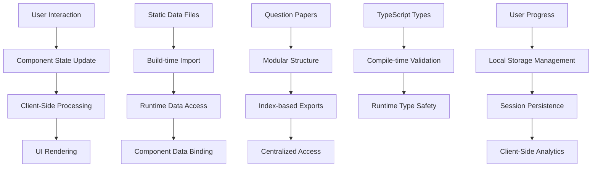

# CTET Study App - Architecture Documentation

## System Overview

The CTET Study App is a comprehensive web-based learning platform designed to help aspiring teachers prepare for the Central Teacher Eligibility Test (CTET) in India. Built with modern web technologies, it provides an interactive and accessible study experience with public access and client-side adaptive learning capabilities.

## Technology Stack

### Frontend Framework

- **React 19.1.1**: Latest React with concurrent fe### Future Enhancements

#### Potential Extensions

1. **Enhanced PWA Features**: Advanced offline capabilities and push notifications
2. **Voice Integration**: Text-to-speech and voice commands for accessibility
3. **Multi-language Support**: Additional Indian languages for regional users
4. **Content Expansion**: More question papers and study materials
5. **Performance Analytics**: Aggregate usage statistics for content improvement
6. **Mobile App**: Native mobile applications for iOS and Android

#### Technical Debt Prevention

- **Bundle Size**: Monitor and optimize bundle size for mobile performance
- **Performance Monitoring**: Add performance metrics for user experience
- **Error Tracking**: Implement client-side error reporting
- **Testing Coverage**: Expand test coverage for new features
- **Documentation**: Keep architecture documentation current with changesc batching
- **TypeScript 5.8.2**: Strict type checking for better code quality and developer experience
- **Vite 6.2.0**: Fast build tool with HMR (Hot Module Replacement)

### UI/UX

- **Tailwind CSS**: Utility-first CSS framework for responsive design
- **Heroicons**: Consistent icon library
- **Custom CSS**: Additional styling for animations and branding

### Development Tools

- **ESLint**: Code linting (implied through TypeScript strict mode)
- **TypeScript Compiler**: Type checking and compilation
- **Vite Dev Server**: Development server with fast refresh

## UI/UX Architecture

### Design System

#### Color Palette

- **Primary Colors**: Blue tones for CTET branding (#1e40af, #3b82f6)
- **Secondary Colors**: Green for success states (#10b981), Red for errors (#ef4444)
- **Neutral Colors**: Grays for text and backgrounds (#374151, #f9fafb)
- **Accent Colors**: Yellow for highlights (#fbbf24)

#### Typography

- **Font Family**: System fonts (Inter, -apple-system, sans-serif)
- **Font Sizes**: Responsive scale (14px to 24px)
- **Font Weights**: 400 (regular), 500 (medium), 600 (semibold), 700 (bold)
- **Line Heights**: 1.5 for readability

#### Spacing System

- **Base Unit**: 4px (0.25rem)
- **Scale**: 4, 8, 12, 16, 20, 24, 32, 40, 48, 64px
- **Consistent Margins/Padding**: Using Tailwind's spacing utilities

### Component Design Patterns

#### Layout Components

- **Container**: Max-width wrapper with responsive padding
- **Grid System**: Flexbox-based responsive grids
- **Card**: Content containers with shadows and rounded corners
- **Modal**: Overlay dialogs for confirmations and forms

#### Interactive Elements

- **Buttons**: Primary, secondary, and ghost variants with hover/focus states
- **Form Controls**: Input fields, checkboxes, radio buttons with validation states
- **Navigation**: Sidebar with active state indicators
- **Tabs**: Horizontal navigation for content sections

#### Feedback Components

- **Loading States**: Spinners and skeleton screens
- **Progress Indicators**: Linear progress bars for tests and modules
- **Notifications**: Toast messages for user feedback
- **Error Boundaries**: Graceful error handling with user-friendly messages

### Responsive Design Implementation

#### Breakpoints

- **Mobile**: < 640px (sm)
- **Tablet**: 640px - 1024px (md, lg)
- **Desktop**: > 1024px (xl, 2xl)

#### Mobile-First Approach

- Base styles for mobile devices
- Progressive enhancement for larger screens
- Touch-friendly button sizes (minimum 44px)
- Optimized typography scaling

#### Layout Adaptations

- **Sidebar**: Collapsible on mobile, fixed on desktop
- **Content Areas**: Single column on mobile, multi-column on desktop
- **Navigation**: Bottom tabs on mobile, sidebar on desktop
- **Tables**: Horizontal scroll on mobile, full width on desktop

### Accessibility Implementation

#### ARIA Support

- **Labels**: aria-label and aria-labelledby for screen readers
- **Roles**: semantic roles for interactive elements
- **States**: aria-expanded, aria-selected for dynamic content
- **Live Regions**: aria-live for dynamic updates

#### Keyboard Navigation

- **Tab Order**: Logical focus flow through interactive elements
- **Keyboard Shortcuts**: Common shortcuts (Enter, Space, Arrow keys)
- **Focus Management**: Visible focus indicators and trap management
- **Skip Links**: Jump to main content

#### Visual Accessibility

- **Color Contrast**: WCAG AA compliance (4.5:1 ratio)
- **Text Alternatives**: Alt text for images and icons
- **Motion Preferences**: Respects prefers-reduced-motion
- **High Contrast Mode**: Support for system high contrast themes

### User Interaction Patterns

#### Navigation Flow

- **Subject Selection**: Sidebar navigation with visual hierarchy
- **Topic Progression**: Linear flow through study modules
- **Test Navigation**: Question-by-question with progress tracking
- **Results Review**: Detailed feedback with improvement suggestions

#### State Management for UX

- **Loading States**: Immediate feedback for user actions
- **Error Handling**: User-friendly error messages with recovery options
- **Success Feedback**: Confirmation for completed actions
- **Progress Persistence**: Resume where user left off

### Performance Considerations for UI/UX

#### Rendering Optimization

- **Component Memoization**: React.memo for expensive components
- **Virtual Scrolling**: For long lists of questions/topics
- **Image Optimization**: Lazy loading and responsive images
- **Bundle Splitting**: Route-based code splitting

#### Animation and Transitions

- **Micro-interactions**: Smooth transitions for state changes
- **Loading Animations**: Skeleton screens and progress indicators
- **Hover Effects**: Subtle feedback for interactive elements
- **Page Transitions**: Smooth navigation between views

### Testing and Quality Assurance

#### Visual Testing

- **Cross-browser Testing**: Chrome, Firefox, Safari, Edge
- **Device Testing**: Mobile, tablet, desktop viewports
- **Accessibility Testing**: Screen reader compatibility
- **Performance Testing**: Lighthouse audits for UI performance

#### User Experience Testing

- **Usability Testing**: User flows and interaction patterns
- **A/B Testing**: Alternative UI designs and features
- **Analytics**: User behavior tracking and heatmaps
- **Feedback Collection**: User surveys and issue reporting

## Application Architecture

### Component Hierarchy

```
App (Root Component)
├── Sidebar (Navigation)
├── Header (Branding)
└── Main Content Area
    ├── Dashboard (Subject Overview)
    ├── StudyModule (Detailed Content)
    ├── MockTest (Timed Assessment)
    ├── MockTestSelection (Test Selection)
    ├── PracticeQuiz (Interactive Questions)
    ├── ReadinessTracker (Progress Analysis)
    └── TestResult (Results Display)
```

### State Management

#### Global State (App Level)

- `currentView`: Current active screen/view
- `selectedSubject`: Currently selected subject
- `selectedTopic`: Currently selected topic
- `selectedPaper`: Currently selected question paper
- `currentContextualTopic`: Contextual help information

#### Component-Level State

- Form inputs and user interactions
- Timer states for mock tests
- Loading states for async operations
- Modal visibility states

### Data Architecture

#### Modular Data Structure

```
constants/
├── data.ts                    # Subject content and topics
├── questionPapers.ts          # Main export file for question papers
├── questionPapers/            # Modular question paper storage
│   ├── index.ts              # Central export hub
│   ├── sed-24-i.ts           # CTET Dec 2024 paper (150 questions)
│   ├── mvd18-i.ts            # Practice paper (15 questions)
│   └── [future-papers].ts    # Additional question papers
└── syllabus.ts               # Syllabus mapping
```

#### Data Flow Architecture



**Data Flow Explanation:**

1. **Static Data Loading**: Question papers and content loaded at build time from modular files
2. **Modular Organization**: Individual question papers stored in separate files for maintainability
3. **Centralized Access**: Index file provides unified access to all question papers
4. **Type Safety**: TypeScript interfaces ensure data structure consistency
5. **Client-Side State**: User preferences and progress stored locally without backend
6. **Session Analytics**: Performance tracking and recommendations processed client-side

## Key Design Decisions

### 1. Public Access Architecture

- **Decision**: No login requirements, fully accessible to all users
- **Benefits**: Maximum accessibility, zero barriers to entry, educational equity
- **Implementation**: Client-side storage for preferences, session-based progress tracking

### 2. Client-Side Adaptive Learning

- **Decision**: Rule-based personalization without user accounts or backend data storage
- **Benefits**: Privacy-focused, works offline, no server dependencies
- **Implementation**: Local storage for user preferences, session-based analytics

### 3. Component-Based Architecture

- **Decision**: Modular React components for maintainability
- **Benefits**: Reusable, testable, and scalable
- **Implementation**: Each feature is a separate component with clear responsibilities

### 4. TypeScript with Strict Mode

- **Decision**: Full TypeScript implementation with strict type checking
- **Benefits**: Compile-time error detection, better IDE support, self-documenting code
- **Implementation**: Comprehensive interfaces and enums for all data structures

### 5. Modular Data Architecture

- **Decision**: Split monolithic question papers into individual files with centralized exports
- **Benefits**: Improved maintainability, easier collaboration, scalable content addition
- **Implementation**: Each question paper in separate file with index-based access pattern

### 6. Static Data Approach

- **Decision**: Pre-built content instead of dynamic API loading
- **Benefits**: Fast loading, offline capability, reduced complexity
- **Implementation**: Large JSON-like data structures in TypeScript files

### 7. Responsive Design

- **Decision**: Mobile-first responsive design
- **Benefits**: Works on all devices, better user experience
- **Implementation**: Tailwind CSS with responsive breakpoints

### 8. Accessibility Features

- **Decision**: Built-in accessibility support
- **Benefits**: Inclusive design, legal compliance, better usability
- **Implementation**: ARIA labels, keyboard navigation, text-to-speech

## Modular Data Architecture

### Architecture Overview

The CTET Study App implements a modular data architecture for question papers to ensure scalability and maintainability as content grows from hundreds to thousands of questions.

### Modular Structure Benefits

#### 1. **Scalability**

- **Easy Content Addition**: New question papers can be added as individual files
- **No Performance Impact**: Only load required question papers
- **Linear Growth**: Adding 10 new papers (1500 questions) requires minimal code changes

#### 2. **Maintainability**

- **Focused Files**: Each question paper is self-contained and easy to edit
- **Clear Organization**: Related questions grouped logically by paper
- **Version Control**: Individual paper changes don't affect others

#### 3. **Collaboration**

- **Parallel Development**: Multiple developers can work on different papers
- **Reduced Conflicts**: Isolated file changes minimize merge conflicts
- **Code Reviews**: Smaller, focused changes are easier to review

#### 4. **Performance**

- **Lazy Loading**: Question papers loaded only when needed
- **Bundle Optimization**: Tree-shaking removes unused content
- **Fast Access**: Index-based lookup for quick paper selection

### Implementation Pattern

#### File Organization

```
constants/questionPapers/
├── index.ts              # Central export hub
├── paper-1.ts           # Individual question paper
├── paper-2.ts           # Individual question paper
└── paper-n.ts           # Additional papers
```

#### Export Strategy

```typescript
// index.ts - Central hub
export { QUESTION_PAPER_1 } from './paper-1';
export { QUESTION_PAPER_2 } from './paper-2';

// questionPapers.ts - Main export
export { QUESTION_PAPERS_DATA } from './questionPapers/index';
```

#### Usage Pattern

```typescript
// Import specific paper
import { QUESTION_PAPER_SED_24_I } from './questionPapers/index';

// Import all papers
import { QUESTION_PAPERS_DATA } from './questionPapers';
```

### Content Expansion Strategy

#### Adding New Question Papers

1. **Create new file**: `constants/questionPapers/new-paper-i.ts`
2. **Export paper object**: Follow established QuestionPaper interface
3. **Update index**: Add export to `constants/questionPapers/index.ts`
4. **Automatic integration**: Main app picks up new papers automatically

#### Quality Assurance

- **Type Safety**: TypeScript ensures data structure compliance
- **Validation**: Interface contracts prevent data corruption
- **Testing**: Individual papers can be tested in isolation

### Future Enhancements

#### Potential Extensions

1. **Dynamic Loading**: Load papers from external sources
2. **Content Management**: Admin interface for paper management
3. **Versioning**: Track paper versions and updates
4. **Analytics**: Track paper usage and difficulty metrics
5. **Personalization**: User-specific paper recommendations

#### Technical Debt Prevention

- **Consistent Structure**: Maintain file naming conventions
- **Documentation**: Update architecture docs with new patterns
- **Testing**: Expand test coverage for new papers
- **Performance Monitoring**: Track loading times and bundle sizes

## File Structure

```
CTET-Study/
├── public/                    # Static assets
├── src/
│   ├── components/           # React components
│   │   ├── App.tsx          # Main application
│   │   ├── Sidebar.tsx      # Navigation
│   │   ├── Header.tsx       # Top bar
│   │   ├── Dashboard.tsx
│   │   ├── StudyModule.tsx
│   │   ├── MockTest.tsx
│   │   ├── PracticeQuiz.tsx
│   │   ├── TestResult.tsx
│   │   ├── ReadinessTracker.tsx
│   │   ├── TTSControls.tsx
│   │   └── GeminiExplainer.tsx (removed)
│   ├── constants/           # Static data (Modular Architecture)
│   │   ├── data.ts
│   │   ├── questionPapers.ts       # Main export file
│   │   ├── questionPapers/         # Modular question papers
│   │   │   ├── index.ts           # Central export hub
│   │   │   ├── sed-24-i.ts        # CTET Dec 2024 (150 questions)
│   │   │   ├── mvd18-i.ts         # Practice paper (15 questions)
│   │   │   └── [future-papers].ts # Additional papers
│   │   └── syllabus.ts
│   ├── types.ts             # TypeScript definitions
│   ├── index.tsx            # Application entry point
│   ├── index.css            # Global styles
│   └── vite.config.ts       # Build configuration
├── docs/                    # Documentation
├── dist/                    # Build output
└── package.json             # Dependencies
```

## Performance Optimizations

### Build-Time Optimizations

- **Code Splitting**: Automatic code splitting by Vite
- **Tree Shaking**: Unused code elimination
- **Minification**: Production build optimization
- **Compression**: Gzip compression for assets

### Runtime Optimizations

- **Lazy Loading**: Components loaded on demand
- **Memoization**: React.memo for expensive re-renders
- **Efficient Updates**: React's reconciliation algorithm
- **Memory Management**: Proper cleanup of timers and event listeners

## Security Considerations

### Client-Side Security

- **Input Validation**: TypeScript provides compile-time validation
- **XSS Prevention**: React's automatic escaping
- **CSP Headers**: Content Security Policy (can be configured)
- **Secure Dependencies**: Regular dependency updates

### Data Security

- **No Personal Data**: No user accounts or personal information stored
- **Local Storage**: User preferences and progress (optional, client-side only)
- **Static Content**: All educational content is public and static
- **HTTPS**: Secure hosting for all static assets

### Public Access Security

- **No Authentication**: Zero login barriers while maintaining security
- **Client-Side Processing**: Sensitive operations handled locally
- **Content Integrity**: Static content prevents data tampering
- **Privacy by Design**: No tracking or data collection by default

## Scalability Considerations

### Code Scalability

- **Modular Architecture**: Easy to add new features
- **Type Safety**: Prevents runtime errors when scaling
- **Component Reusability**: Consistent UI patterns

### Content Scalability

- **Modular Structure**: Individual question papers in separate files
- **Linear Growth**: Adding new content doesn't impact existing files
- **Performance**: Only load required content, efficient data structures
- **Maintainability**: Easy to add 1500+ questions across multiple papers

### User Scalability

- **No Backend**: No server-side user management or database scaling
- **Static Hosting**: Can handle millions of users through CDN
- **Client-Side Processing**: User load distributed across client devices
- **Offline Capability**: Works without internet connectivity

## Deployment Architecture

### Development Environment

- **Local Development**: Vite dev server
- **Hot Reload**: Instant updates during development
- **Type Checking**: Real-time TypeScript validation

### Production Build

- **Static Assets**: Optimized bundle generation
- **CDN Ready**: Can be served from any static hosting
- **Progressive Web App**: Enhanced with PWA features for offline access
- **Public Access**: No authentication or user management required

### Hosting Options

- **Static Hosting**: Netlify, Vercel, GitHub Pages, or any CDN
- **No Backend Required**: Pure static site deployment
- **Global Distribution**: CDN ensures fast access worldwide
- **Cost Effective**: Minimal hosting costs for static content

## Future Enhancements

### Potential Architecture Extensions

1. **State Management**: Redux/Zustand for complex state
2. **API Integration**: Backend for dynamic content
3. **Database**: User progress and results storage
4. **Authentication**: User accounts and personalization
5. **Real-time Features**: Live quizzes and leaderboards
6. **Offline Support**: Service workers for offline functionality
7. **Analytics**: Usage tracking and insights
8. **Multi-language**: Internationalization support

### Technical Debt Considerations

- **Bundle Size**: Monitor and optimize bundle size
- **Performance Monitoring**: Add performance metrics
- **Error Tracking**: Implement error reporting
- **Testing Coverage**: Expand test coverage

## Development Workflow

### Local Development

1. Clone repository
2. Install dependencies: `npm install`
3. Start dev server: `npm run dev`
4. Open browser to `http://localhost:5173`

### Production Build

1. Build optimized version: `npm run build`
2. Preview production build: `npm run preview`
3. Deploy `dist/` folder to static hosting

### Code Quality

- TypeScript strict mode enabled
- ESLint configuration (via TypeScript)
- Pre-commit hooks (can be added)
- Automated testing (can be expanded)

This architecture provides a solid foundation for a scalable, maintainable, and user-friendly CTET preparation platform.
