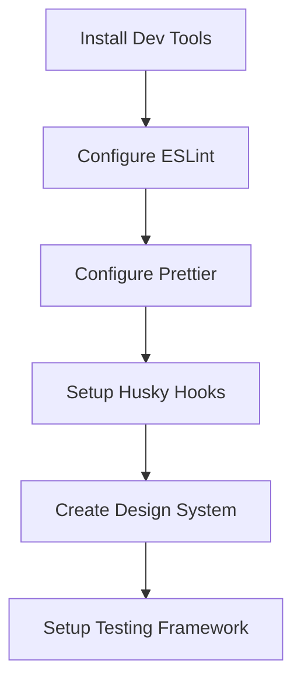
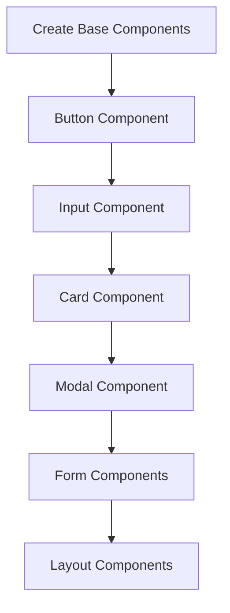
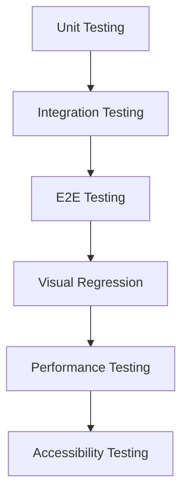
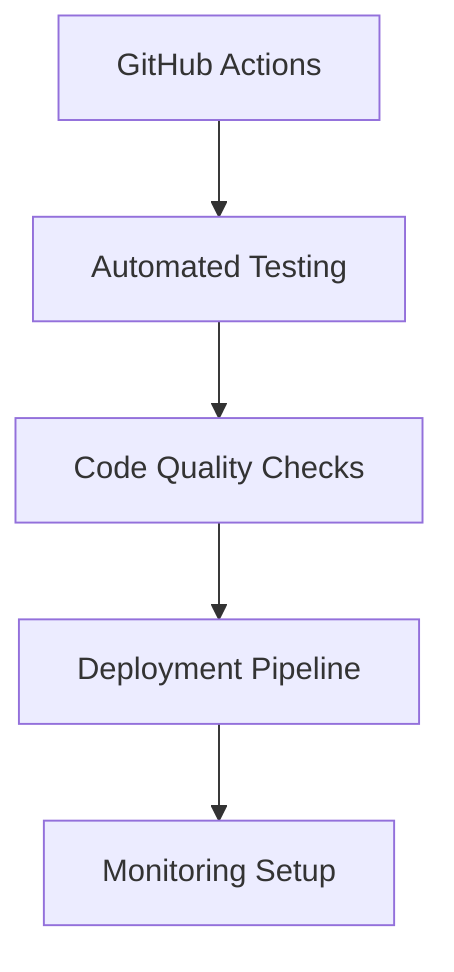

# CTET Study App - Consistency & Quality Assurance Roadmap

## 🎯 Executive Summary

This comprehensive roadmap outlines strategies and tools to ensure UI/UX uniformity and code consistency in the CTET Study App. By implementing these practices, you'll maintain high-quality standards as your application scales from hundreds to thousands of questions.

## 📋 Current Status Assessment

### ✅ What's Already in Place

- **TypeScript**: Strong typing foundation
- **React 19**: Modern component architecture
- **Tailwind CSS**: Utility-first styling approach
- **Modular Architecture**: Well-organized question papers structure
- **Documentation**: Comprehensive architecture docs

### 🔄 What Needs Implementation

- **Code Quality Tools**: ESLint, Prettier, Husky
- **Testing Framework**: Jest, React Testing Library
- **Design System**: Standardized components and patterns
- **Development Workflow**: Automated quality checks
- **Documentation**: Component and API documentation

## 🛠️ Implementation Priority Matrix

### Phase 1: Foundation (Week 1-2) - HIGH PRIORITY



**Key Deliverables:**

- ✅ ESLint configuration (`.eslintrc.json`)
- ✅ Prettier configuration (`.prettierrc.json`)
- ✅ Husky pre-commit hooks
- ✅ Design System documentation (`DESIGN_SYSTEM.md`)
- ✅ Coding Standards (`CODING_STANDARDS.md`)
- ✅ Implementation Guide (`IMPLEMENTATION_GUIDE.md`)

### Phase 2: Component Standardization (Week 3-4) - HIGH PRIORITY



**Key Deliverables:**

- Reusable UI component library
- Storybook documentation
- Component testing suite
- Accessibility compliance

### Phase 3: Quality Assurance (Week 5-6) - MEDIUM PRIORITY



**Key Deliverables:**

- 80%+ test coverage
- Automated testing pipeline
- Performance monitoring
- Accessibility audit tools

### Phase 4: Automation & CI/CD (Week 7-8) - MEDIUM PRIORITY



**Key Deliverables:**

- Automated CI/CD pipeline
- Code quality gates
- Deployment automation
- Error tracking and monitoring

## 📊 Quality Metrics Dashboard

### Code Quality Metrics

```typescript
interface QualityMetrics {
  testCoverage: number; // Target: >80%
  lintErrors: number; // Target: 0
  typeErrors: number; // Target: 0
  bundleSize: number; // Target: <500KB
  lighthouseScore: number; // Target: >90
  accessibilityScore: number; // Target: 100
}
```

### Development Velocity Metrics

```typescript
interface DevelopmentMetrics {
  buildTime: number; // Target: <30s
  testTime: number; // Target: <60s
  deploymentFrequency: string; // Target: Daily
  meanTimeToResolution: number; // Target: <4 hours
}
```

## 🎨 Design System Implementation

### Component Library Structure

```
src/components/
├── ui/                    # Reusable UI components
│   ├── Button/
│   │   ├── Button.tsx
│   │   ├── Button.test.tsx
│   │   ├── Button.stories.tsx
│   │   └── index.ts
│   ├── Input/
│   ├── Card/
│   └── Modal/
├── layout/               # Layout components
├── forms/                # Form components
└── shared/               # Shared utilities
```

### Design Token System

```css
/* CSS Custom Properties for Design Tokens */
:root {
  /* Colors */
  --color-primary-50: #eff6ff;
  --color-primary-500: #3b82f6;
  --color-success-500: #10b981;
  --color-error-500: #ef4444;

  /* Typography */
  --font-size-xs: 0.75rem;
  --font-size-sm: 0.875rem;
  --font-size-base: 1rem;
  --font-size-lg: 1.125rem;

  /* Spacing */
  --space-1: 0.25rem;
  --space-2: 0.5rem;
  --space-3: 0.75rem;
  --space-4: 1rem;

  /* Border Radius */
  --radius-sm: 0.25rem;
  --radius-md: 0.375rem;
  --radius-lg: 0.5rem;

  /* Shadows */
  --shadow-sm: 0 1px 2px 0 rgb(0 0 0 / 0.05);
  --shadow-md: 0 4px 6px -1px rgb(0 0 0 / 0.1);
  --shadow-lg: 0 10px 15px -3px rgb(0 0 0 / 0.1);
}
```

## 🔧 Development Workflow

### Daily Development Routine

```bash
# Morning: Start development environment
npm run dev                    # Start dev server
npm run storybook             # Start Storybook (if available)

# During development: Quality checks
npm run lint                  # Check code quality
npm run format               # Format code
npm run test                 # Run tests
npm run test:coverage        # Check coverage

# Before commit: Automated checks
git add .
npm run pre-commit           # Runs lint, format, test
git commit -m "feat: add new component"

# Code review: Manual checks
npm run build                # Production build check
npm run test:a11y           # Accessibility check
```

### Code Review Checklist

```markdown
## Code Review Checklist

### Functionality

- [ ] Requirements are met
- [ ] Edge cases handled
- [ ] Error states managed
- [ ] Loading states implemented

### Code Quality

- [ ] TypeScript types are correct
- [ ] No linting errors
- [ ] Code is well-formatted
- [ ] No console.logs in production
- [ ] Proper error handling

### Testing

- [ ] Unit tests written
- [ ] Integration tests included
- [ ] Edge cases tested
- [ ] Accessibility tested

### Performance

- [ ] No unnecessary re-renders
- [ ] Bundle size impact considered
- [ ] Images optimized
- [ ] Lazy loading implemented

### Design

- [ ] Follows design system
- [ ] Responsive design
- [ ] Accessibility compliant
- [ ] Consistent with existing UI
```

## 📈 Success Metrics

### Short-term Goals (3 months)

- [ ] 100% ESLint compliance
- [ ] 80%+ test coverage
- [ ] Design system adoption in 90% of components
- [ ] Zero critical accessibility issues
- [ ] <30s build time

### Medium-term Goals (6 months)

- [ ] Automated deployment pipeline
- [ ] Performance monitoring dashboard
- [ ] Component library documentation
- [ ] Cross-browser compatibility
- [ ] Mobile performance optimization

### Long-term Goals (12 months)

- [ ] 95%+ test coverage
- [ ] <500KB bundle size
- [ ] 100 Lighthouse performance score
- [ ] Multi-language support
- [ ] Advanced analytics integration

## 🚨 Risk Mitigation

### Technical Risks

| Risk                         | Impact | Mitigation                         |
| ---------------------------- | ------ | ---------------------------------- |
| Inconsistent component usage | High   | Design system + Storybook          |
| Technical debt accumulation  | Medium | Regular refactoring sprints        |
| Performance degradation      | High   | Performance budgets + monitoring   |
| Accessibility issues         | Medium | Automated testing + manual reviews |

### Process Risks

| Risk                    | Impact | Mitigation                          |
| ----------------------- | ------ | ----------------------------------- |
| Team knowledge gaps     | Medium | Documentation + training            |
| Code review bottlenecks | Low    | Clear guidelines + automation       |
| Deployment issues       | High   | Staging environment + rollback plan |

## 📚 Resources & References

### Documentation

- [DESIGN_SYSTEM.md](./DESIGN_SYSTEM.md) - Complete design system guide
- [CODING_STANDARDS.md](./CODING_STANDARDS.md) - Code quality standards
- [IMPLEMENTATION_GUIDE.md](./IMPLEMENTATION_GUIDE.md) - Practical implementation steps
- [ARCHITECTURE.md](./ARCHITECTURE.md) - System architecture overview

### Tools & Technologies

- **ESLint**: Code linting and quality
- **Prettier**: Code formatting
- **Jest**: Unit testing framework
- **React Testing Library**: Component testing utilities
- **Storybook**: Component documentation
- **Husky**: Git hooks automation
- **Tailwind CSS**: Utility-first styling
- **TypeScript**: Type safety

### Learning Resources

- [React Documentation](https://react.dev)
- [TypeScript Handbook](https://typescriptlang.org/docs/)
- [Testing Library Documentation](https://testing-library.com)
- [Web Accessibility Guidelines](https://www.w3.org/WAI/WCAG21/quickref/)

## 🎯 Next Steps

### Immediate Actions (This Week)

1. **Install development tools** - ESLint, Prettier, Husky
2. **Configure quality gates** - Set up pre-commit hooks
3. **Create base components** - Button, Input, Card following design system
4. **Set up testing framework** - Jest + React Testing Library
5. **Document existing patterns** - Create component usage examples

### Weekly Checkpoints

- **Week 1**: Development environment setup complete
- **Week 2**: First reusable components created and tested
- **Week 3**: Design system adoption in 50% of components
- **Week 4**: Testing coverage reaches 60%
- **Week 5**: Automated quality checks implemented
- **Week 6**: Performance optimization baseline established

### Success Criteria

- ✅ All new components follow design system
- ✅ Code review process includes quality checklist
- ✅ Automated tests run on every commit
- ✅ Performance budgets are maintained
- ✅ Accessibility standards are met
- ✅ Documentation is kept up-to-date

This roadmap provides a structured approach to ensuring UI/UX uniformity and code consistency as your CTET Study App grows and evolves.
